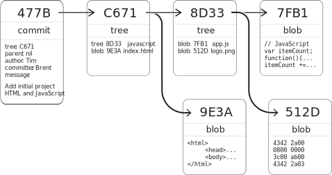
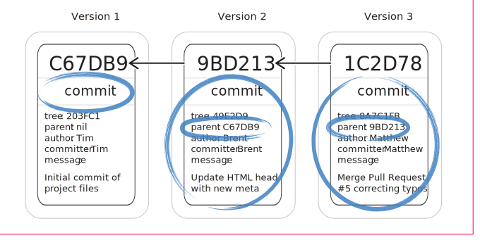
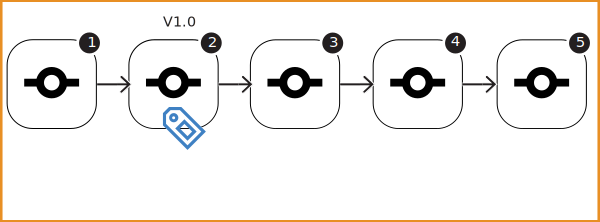
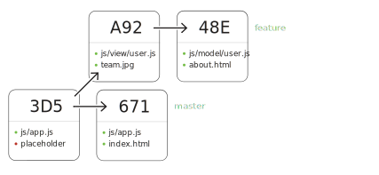
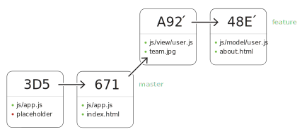

---

<span class="mega-octicon octicon-microscope"></span>

# GitHub Advanced

Command line deep dive, problem solving techniques, and GitHub efficiencies

<div class="objectives">
<input type="checkbox" id="obj1"><label for="obj1">Understand and apply commit DAG concepts</label>
<input type="checkbox" id="obj2"><label for="obj2">Create tag release on GitHub and command line</label>
<input type="checkbox" id="obj3"><label for="obj3">Apply ignore patterns to projects</label>
<input type="checkbox" id="obj4"><label for="obj4">Improve day-to-day efficiency with shortcuts</label>
<input type="checkbox" id="obj5"><label for="obj5">Capture and rewrite branch history</label>
<input type="checkbox" id="obj6"><label for="obj6">Use multiple remote repository interactions</label>
<input type="checkbox" id="obj7"><label for="obj7">Use external Git repositories as dependencies</label>
<input type="checkbox" id="obj8"><label for="obj8">Interact with GitHub from the command line</label>
</div>

---


---

## Understanding Git
## Navigating history

Explore the structure and way change is preserved in Git.

---

---



---

---



---

---

```
git log [branch]..[branch]
```

---

---

```
git log [branch]...[branch]
```

---

---

```
$ git log --left-right
```

---

---

```
$ git log --diff-filter=[A|M|D]
```

---

---

```
$ git branch --merged
```

---

---

```
git branch --no-merged
```

---

---

```
git rev-parse [commit-shorthand]
```

---

---

```
git name-rev [commit]
```

---


1. Understand the way Git preserves history and data
2. Use shortcuts to navigate commit history
3. Filter `log` option switches for refined version querying


### Details
Git version control is composed of three fundamental object types

Object Type | Purpose
----------- | ------
Blob        | Store file content
Tree        | Preserve path and structure
Commit      | Serve as unique historical reference

These three data types use a SHA-1 for unique identification and establish built-in data integrity from the commit, tree, and blob *fingerprints*.

#### Traversing History without Commit IDs
Historical commit points are simple to discuss using *HEAD* rather than hexadecimal SHA-1 identifiers. This shorthand works on the command line, as well as on [GitHub](https://help.github.com/articles/comparing-commits-across-time).

Shorthand              | Explanation
---------------------- | -----------
`HEAD`                 | Current commit
`HEAD^2`               | Second parent if merge commit, otherwise second ancestor
`HEAD~2`               | Second ancestor of the current commit
`HEAD@{one.day.ago}`   | Reachable by current branch from one day ago
`HEAD@{today}`         | All commits reachable by current branch made *today*

#### Navigating history
The `log` command is like a search engine. By default it shows all history, but one can refine the output to view commits by: author and committer, the time changes occurred, patch content, or even the message description. This is called revision selection.

Show only those commits made by a given Git `user.name`, or within a particular time range:

```bash
$ git log --author [author-name]
$ git log --since [integer].days.ago
```

Searching by a string or regular expression is often the most efficient way of finding history:

```bash
$ git log -S [string-in-patch]
$ git log -G [regex-pattern-in-patch]
$ git log --grep=[regex-in-message]
```

Filtering by file state, i.e. *added* (A), *modified* (M), or *deleted* (D):

```bash
$ git log --diff-filter=[A|M|D]
$ git log --follow --stat --diff-filter=[A|M|D] -- <filename>
```

Specifying commit ranges, as detailed on the [Git-scm.com web site](http://git-scm.com/book/en/Git-Tools-Revision-Selection):

```bash
$ git log --oneline --left-right master..other
$ git log --oneline --left-right master...other
```

### Videos
<iframe src="//player.vimeo.com/video/95811891" width="500" height="350" frameborder="0" webkitallowfullscreen mozallowfullscreen allowfullscreen></iframe>


---

## Collaborating on change & releases

Cutting and creating releases on the command line and on GitHub.

---

---

```
git tag [tagname] [commit]
```

---

---

```
git tag -a [tagname] [commit]
```

---

---

```
git push [remote] [tagname]
```

---

---

```
git tag -d [tagname]
```

---

---

```
git describe
```

---

---

```
git tag -s -m "[message]" [tagname] [commit]
```

---


1. Use the command line for branching strategies
2. Understand best branch and collaboration workflows
3. Apply `tag`s to commits to indicate releases


---



---

### Details

#### Branching patterns, best practices
* Branch by feature
 Compatibility with Pull Requests
* GitHub Flow
    * [How GitHub Develops](https://github.com/blog/919-how-github-develops)
    * [GitHub Flow blog post](http://scottchacon.com/2011/08/31/github-flow.html)
    * Works well with Pull Requests when one-layer deep
    * Think of features much smaller than typical
* git-flow
    *  Made popular on Git by Vincent Driessen and his NVIE site
    * [Git-Flow: A Successful Branching Model](http://nvie.com/posts/a-successful-git-branching-model/)
    * [Git-Flow Source](https://github.com/nvie/gitflow)
    * Too many levels?
    * GitHub prefers "Simplest thing that works"
* Rebase before sharing (sending a Pull Request)
  * [Contributing to Spring Social](https://github.com/spring-projects/spring-social/wiki/Contributing)
  * [How To Merge Without Fear](http://blog.springsource.org/2010/12/21/git-and-social-coding-how-to-merge-without-fear/)
  * [What to do when things get complicated](http://blog.springsource.org/2011/07/18/social-coding-pull-requests-what-to-do-when-things-get-complicated/)

#### Cutting releases
* Why create a tag through the web UI?
* Not a branch HEAD. Points to a specific commit.
* Attaching binaries to releases (Web UI and API)
* Tag with message (defaults to annotated)
* Force existing tag to new ref
* Delete a tag
* `$ git describe` to name the most recent reachable tag
* Tag types (reference, annotated, signed)
* Deleting a tag locally
* Deleting tag on a remote
* Version numbers
  * `major.minor.fix`
  * [Semantic versioning](http://semver.org)

Generating a lightweight reference tag is simple:

```shell
$ git tag [TAGNAME] [commit]
```

Annotated tags generate a complete data object in the Git repository, storing the author, a time-stamp, a specific SHA-1 reference, and an optional GPG key for signing work.

```shell
$ git tag -a [TAG_NAME] [commit|branch]
$ git tag -a -m [TAG_NAME] [commit|branch]
```

The `tag` command offers a number of ways to understand what it represents, ways of replacing it, and even the option of eliminating it if necessary.

```shell
$ git tag -s -m[message] [TAGNAME]
$ git tag -f [TAGNAME]
$ git tag -d [TAGNAME]
$ git describe
$ git describe [SHA]
$ git tag -d 12345
$ git push origin :[tag-name-to-delete]
```


---

## Ignoring & cleaning up files

Avoid tracking unimportant files.

---

---

```
$ vi .gitignore
```

---

---

```
$ git config core.excludesfile [path]
```

---

---

```
$ git add -f [path]
```

---

---

```
$ git clean -f
$ git clean -fd
$ git clean -fx
```

---


1. Set ignore patterns to prevent accidental versioning
2. Clean working directory of untracked files
3. Tidy working directory of any `.gitignore` matched files


### Details
#### Repository-specific ignores
* Ignoring files from repository & system level
* Reviewing ignored files with custom command
* Forcing a staging of ignored files

```shell
$ vi .gitignore
```

#### System-wide ignores
```shell
$ git config core.excludesfile [path]
```

#### Listing ignored files
```shell
$ git config alias.show-ignored \
    "ls-files --exclude-standard
    --others --ignored"
```

#### Staging ignored files
```shell
$ git add -f [path]
```

#### Removing unwanted files
* Purge untracked in working directory
* for directories
* for removing ignored files (useful for tidying build artifacts)

```
$ git clean -f
$ git clean -fd
$ git clean -fx
```

### Video
<iframe src="//player.vimeo.com/video/99804597" width="500" height="350" frameborder="0" webkitallowfullscreen mozallowfullscreen allowfullscreen></iframe>

---

## Mastering shortcuts & efficiencies

Speed up your workflow.

---

---

```
$ git commit -a -m"[message]"
```

---

---

```
$ git commit --amend -m "[updated message]"
```

---

---

```
$ git checkout -b [branch] [base]
```

---

---

```
$ git stash
```

---

---

```
# Stage by patch
$ git add -p [file]

# Unstage by patch
git reset HEAD -p [file]
```

---


1. Use built-in shortcuts for committing and branch switching
2. Learn when to use `stash` and when to use longer-living branches
3. Commit partial file content *hunks* with `add` and `reset` patch switches
4. Avoiding repetitive conflict resolution with `rerere`


### Details
#### Shortcuts
* Shortcuts to multiple steps
* Useful custom commands

Add and commit along with the commit message:

```shell
$ git commit -am "[message]"
```

Commit, amend, and provide the commit message:

```shell
$ git commit --amend -m "[updated message]"
```

Checkout and create a branch:

```shell
$ git checkout -b [branch] [base]
```

#### Temporary changes
* Name your stash
* List stashes
* Use specific stashes

```shell
$ git stash
$ git stash save "<description>"
$ git stash --include-untracked
$ git stash list
$ git stash pop <name>
$ git stash drop <name>
$ git stash apply
$ git stash clear
$ git stash -p
```

#### Isolating Work
* Version patches of large change sets
* Stage interactively on command line
* Revise to-be-committed patch

```bash
 Stage by patch
$ git add -p [file]

 Unstage by patch
git reset HEAD -p [file]
```

#### Avoiding repetitive conflicts
- **Re**use **re**corded **re**solution
- Preserves pre-image to simplify conflicts

```shell
$ git config rerere.enable true
```

---

## Capturing pieces of history

Craft and acquire commits with selective, as-needed commands.

---

---

```
# Generate new commit from specified commit
$ git cherry-pick [commit]

# List branches containing same patch
$ git cherry [comparison-branch]
```

---

---

```
# Stage the file from a specific commit
git checkout [commit] -- [path]
```

---



1. Capture select commits and generate new history on separate branches
2. Determine commit history existence in independent branches
3. Capture path-specific change from a commit with multiple files


### Details
Capturing changes from other branches or in orphaned commit history becomes a useful and time-saving operation. With `cherry-pick`, authorship and attribution fields remain, versioned changes are carried over, and a new commit is generated.

```shell
# Generate new commit on current branch with patch of specified commit
$ git cherry-pick [commit]

# List branches containing same patch
$ git cherry [comparison-branch]
```

Use `checkout` to get the functionality of `cherry-pick` without automatically creating a new commit.

```shell
# Stage the versioned file from a specific commit
git checkout [commit] -- [path]
```


---

## Rewriting and crafting history

Rebase and reorder existing commits for improved historical context.

---

---


---

---



---

---



---


---

```
$ git rebase [base-commit]
```

---

---

```
$ git pull --rebase
```

---

---

```
$ git config branch.autosetuprebase
$ git config branch.[master].rebase true
```

---

---


---

---


---

---

```
$ git rebase -i [base-commit]
```

---

---

```
# When commits contain `fixup!` or `squash!`
$ git rebase -i --autosquash [base-commit]
```

---


1. Replay branch history with `rebase`
2. Understand the side effects of rewriting history
3. Rewrite history interactively with `rebase -i`
4. Resolve merge conflicts during a rebase



### Details
Use `rebase` to edit existing commit history. But pay close attention to how it differs from `merge`

#### Rebasing a branch
Re-playing branch-specific commits against a base is the most common use case for rebase.

```shell
$ git checkout <featurebranch>
$ git rebase master
```

#### Rebase configuration
`pull` can be configured to replay all local commits ahead of the incoming upstream ones.

```shell
$ git config pull.rebase true
```

#### Handling conflicts
Resolving a conflict during a rebase requires intervention, and then signaling that the conflict is resolved.

```shell
# fix conflicts
$ git add [conflict-free file]
$ git rebase --continue
```

#### Reordering History
The `rebase -i` command operates similarly to `rebase` in its plain form, but allows for reordering commits, discarding commits, and revising existing commits.

```bash
# Rewrite any commits back to specified base commit
$ git rebase -i <commit>
```

Rewriting shared repository history is typically inadvisable and is easily avoided by using remote branches as the base commit of a `rebase`.

```bash
$ git rebase -i [remote]/[branch]
```

Automatically arrange history and `rebase -i` steps with `fixup!` and `squash!`. Prefix messages of work-in-progress commits to efficiently collapse them during an interactive rebase.

```bash
$ git rebase -i --autosquash [ref]
```


---

## Reviewing & synchronizing

Interact, investigate, and integrate remote repository histories.

---

---

```shell
$ git remote -v
$ git branch -vv
```

---

---

```
$ git remote show <remote-name>
```

---

---

```shell
# List refs of upstream
$ git ls-remote [remote]
```

---

---

```
git pull [remote] [pull-request-namespace]
```

---

---

```
# Retrieve, store as temporary branch
$ git fetch [remote] refs/pull/[num]/head
```

---

---

```
$ git show FETCH_HEAD
```

---

---

```
$ git merge --no-commit --no-ff FETCH_HEAD
```

---



1. Review GitHub Pull Requests from the command line
2. Get Pull Request history temporarily and with branches
3. Customize `fetch` operations with *refspecs*


### Details
#### Reviewing remote branches
* Pull Requests to horizontal contributors
* Pull Requests multiple levels up
* Converting Issues to Pull Requests
* Pull Requests as Issues with code
* Automatic closing of Pull Requests by local merges
* Merges must be _made by recursive_
* Retrieving Pull Requests locally to resolve conflicts
(without locally merging to target branch)

```shell
$ git ls-remote origin
$ git fetch origin refs/pull/1/head

$ git show FETCH_HEAD
$ git merge --no-commit --no-ff FETCH_HEAD
```

#### Examining remote branches
```shell
$ git remote -v
$ git remote show <remote-name>
$ git ls-remote
$ git branch -vv
```

#### Retrieving arbitrary commits
To just retrieve the commits to `FETCH_HEAD`:

```shell
$ git fetch [remote] [pull-request-namespace]
```

To merge the retrieved commits into a branch:

```shell
$ git pull [remote] [pull-request-namespace]
```

#### Leveraging FETCH_HEAD
```shell
$ git fetch <URL> <branch>
$ git checkout FETCH_HEAD
$ git branch <newbranchname> FETCH_HEAD
```

#### What are refspecs?
* Specification for retrieval and pushing
* Used implicitly during fetch, pull, and push
* Altered by option switches like `--tags`
* Stored in `.git/config`
* Ability to retrieve Pull Request branches

#### Refspec examples
```
 Source and destination refspecs
$ git fetch [repository-URL] [source]:[destination]

$ git fetch [repository-URL] master
 * branch     master     -> FETCH_HEAD

$ git fetch origin refs/pull/1/head
 * branch     refs/pull/1/head -> FETCH_HEAD
```

#### Refspec to retrieve Pull Requests
```
$ git config --add remote.[upstream].fetch "+refs/pull/*/head:refs/remotes/[upstream]/pull/*"
```


---

## Filtering histories & externalizing dependencies

Separate single, large repository histories into individual projects.

---

---

```shell
# Rewrite all history with
# respect to files in directory
$ git filter-branch
--subdirectory-filter [dir]
-- --all
```

---

---

```
# Rewrite history, applying Git command
# across all commits
$ git filter-branch --index-filter
'git rm --cached
--ignore-unmatch [file]' HEAD
```

---

---

```
$ git submodule add [repository-URL] [folder]
```

---

---

```
$ git submodule init
$ git submodule update

# OR

$ git clone --recursive [URL]
```

---



1. Separate versioned content in a repository into a separate one
2. Clean up unwanted history repository-wide with `filter-branch`
3. Incorporate external repositories as dependencies with `submodule`


### Details
```shell
# Rewrite all history with respect to files in [dir]
$ git filter-branch
    --subdirectory-filter [dir]
    -- --all

# Rewrite history, applying `git rm` across all commits
$ git filter-branch --index-filter
    'git rm --cached
    --ignore-unmatch [file]' HEAD
```

#### Adding submodules
Add a separate repository as a subdirectory:

```
$ git submodule add [repository-URL] [folder]
```

#### Using submodules
For a freshly cloned repository with submodules

```
 Step-by-step
$ git submodule init
$ git submodule update

 Single process with option switches
$ git submodule update --init --recursive
```


---

## Signing work

Verify authenticity with GPG keys

---

---

```shell
$ git commit --signoff
```

---

---

```shell
# Display signatures per commit
$ git log --show-signature
```

---

---

```
# Merge only if all signatures match public keys
$ git merge --verify-signatures
```

---



1. Use a GPG key to sign a specific commit
2. Verify a signed commit
3. Use a GPG key to sign a Git tag
4. Verify a signed tag


### Details
#### Configuring GPG
```shell
$ gpg --list-keys
pub   1024D/627CBB21 2014-08-01
uid                  Matthew McCullough

 Use 627CBB21 as the signing key's ID
$ git config --global user.signingkey [ID]
```

#### Using GPG signatures on commits
```shell
$ git commit --gpg-sign
# or the shorthand invocation...
$ git commit -S

# Display signatures per commit
$ git log --show-signature

# Merge only if all signatures match public keys
$ git merge --verify-signatures
```

#### Using GPG signatures on tags

```shell
# Create a signed tag
$ git tag -s [tag-name] [commit]

# Verify signature of tag
$ git tag -v [tag-name]
```


---

## Using GitHub CLI and the API

Use GitHub features directly from the command line.

---


1. Create a GitHub (public or private) repository from the command line
2. Create a tracking branch and open a Pull Request from the command line
3. Clone a public, open source repository and Fork it from the command line


### Details

#### Command line interface
* Uses the API for interfacing with your repository
* Stores OAuth token, credentials
* Highly efficient for power-users
* Hub and GitHub merging into one project

```shell
 Create a new public repository on your GitHub account
$ gh create

 Create a new private repository on your GitHub account
$ gh create -p

 Open a Pull Request for the current branch
$ gh pull-request

 Create a fork of the cloned repository on your GitHub Account
$ gh fork

 Launch a web browser with the branch comparison view
$ gh compare

 Launch a web browser to the repository home page
$ gh browse
```

#### The GitHub API

```shell
 Anonymous
$ curl <URL>

 Pass credentials on CLI
$ curl -u <user:password> <URL>

 Use .netrc file
$ curl -n <URL>
```

There are a number of libraries for interfacing with the GitHub API, all of which are available at [octokit.github.io](http://octokit.github.io/)


---

## Diff & merge tool

Go beyond command line comparison with visual tooling.

---


1. Setup a preferred visual tool for diff and merge operations
2. Run the `difftool` to compare uncommitted file changes
3. Generate a merge conflict and resolve using a `mergetool`


### Details
* [Atom Merge Conflict plugin](https://atom.io/packages/merge-conflicts)
* [P4Merge](http://www.perforce.com/downloads/Perforce/20-User)
* Opendiff
* KDiff
* Kaleidoscope
* Vimdiff
* Meld

Difftool execution:

```
$ git difftool --tool-help
$ git config diff.tool <tool-name-in-config>
$ git config difftool.prompt false
$ git config difftool.<tool-name>.cmd "<path [args]>"
```

A sample `.gitconfig` file:

```
[diff]
    tool = p4merge
[difftool "p4merge"]
    cmd = "/Applications/p4merge.app/Contents/Resources/launchp4merge $LOCAL $REMOTE"
[difftool]
    prompt = false
```


Mergetool execution:

```
$ git config --global merge.tool p4mergetool

$ git config --global mergetool.p4mergetool.cmd "/Applications/p4merge.app/Contents/Resources/launchp4merge \$PWD/\$BASE \$PWD/\$REMOTE \$PWD/\$LOCAL \$PWD/\$MERGED"

$ git config --global mergetool.p4mergetool.trustExitCode false

$ git config --global mergetool.keepBackup false
```

A sample `.gitconfig` file:

```
[merge]
    tool = Kaleidoscope
[mergetool "p4mergetool"]
    cmd = " /Applications/p4merge.app/Contents/Resources/launchp4merge $PWD/$BASE $PWD/$REMOTE $PWD/$LOCAL $PWD/$MERGED"
    keepBackup = false
```


---

## Additional resources

---

### Details
This course covers many advanced uses of Git and GitHub, and yet there is still more to explore. We've included some of the most useful resources for our students with insatiable appetites.

#### Advanced Git Videos
* [Mastering Advanced Git, O'Reilly video series](http://bit.ly/ogitvid2)
* [The Fringes of Git, Git internals video](http://www.youtube.com/watch?v=qh-R0-7Ii_U)
* [Git and GitHub LiveLessons, Pearson InformIT LiveLessons (Workshop)](http://www.informit.com/store/git-and-github-livelessons-workshop-9780133991772)

#### Tools
* [`gh`, GitHub command line utility](https://github.com/jingweno/gh)
* [oh-my-zsh, ZSH plugin framework](https://github.com/robbyrussell/oh-my-zsh)

#### Git Documentation
* [Git `man` page command documentation](https://www.kernel.org/pub/software/scm/git/docs/git.html)
